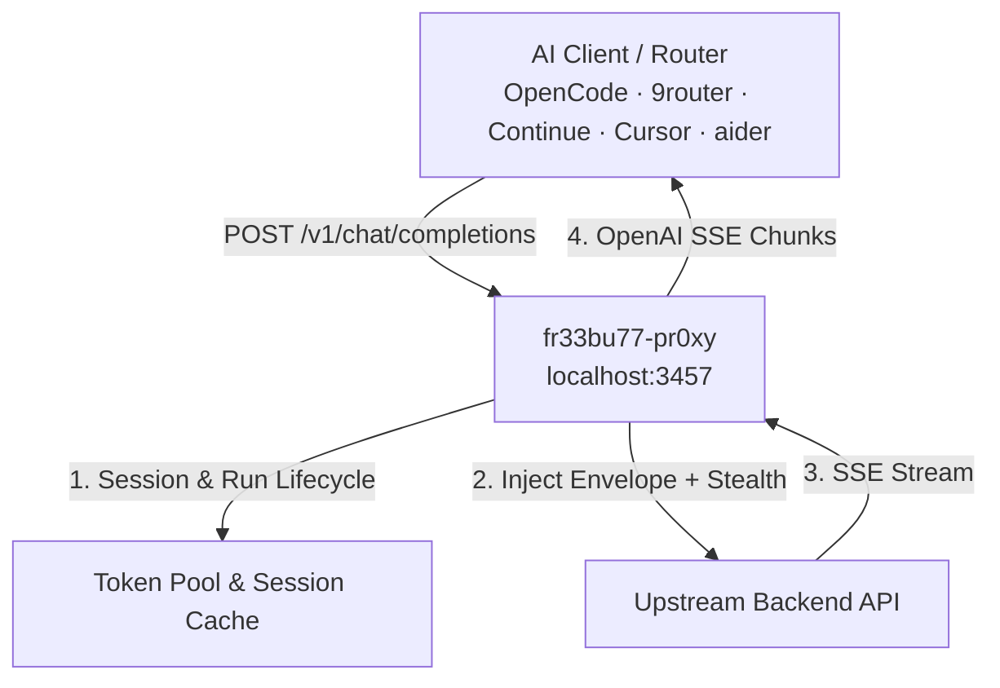

# fr33bu77-pr0xy (AI Gateway & Token Pool)

[](https://github.com/trefeon/freebuff-proxy/actions/workflows/ci.yml)
[](https://github.com/trefeon/freebuff-proxy/releases)
[](https://github.com/trefeon/freebuff-proxy/blob/main/LICENSE)

An OpenAI-compatible high-performance gateway and bridge for AI coding assistants. Connect any OpenAI-compatible client or router (OpenCode, 9router, Continue, Cursor, aider, OmniRouter, LiteLLM) to upstream AI agent models with built-in token pooling, session lifecycle management, and TLS stealth.

> **Reverse-Engineered Protocol Bridge.**
> `freebuff-proxy` is built by reverse-engineering the wire protocol and session lifecycle of official AI coding CLI tools (Codebuff / FreeBuff). It transparently translates standard OpenAI REST requests into the upstream session-admission protocol, injecting required CLI request envelopes, metadata context, model-bound agent runs, tool schema normalizations, and browser JA3 TLS stealth handshakes. Direct OpenAI chat completions and SSE streaming are supported end-to-end.

---

## Features

- **OpenAI-Compatible API**: Serves `/v1/chat/completions`, `/v1/models`, `/healthz`, and Prometheus `/metrics` on `127.0.0.1:3457`.
- **Dynamic Reasoning Effort**: Full support for OpenAI `reasoning_effort` (`low`, `medium`, `high`, `max`) mapped directly to upstream reasoning engines.
- **Session & Run Lifecycle**: Manages upstream session handshakes, model locking recovery (`DELETE` → re-`POST`), and grace draining automatically.
- **Token Pooling & Bridge Mode**:
  - **Pooled Mode**: Comma-separate tokens in `AUTH_TOKENS=tok1,tok2` with automatic round-robin and error failover.
  - **Bridge Mode**: Zero-storage relay when `AUTH_TOKENS` is empty — each client or router sends its own token via `Authorization: Bearer <token>`.
- **TLS Stealth & Egress Proxies**: Supports `HTTP_PROXY`, `SOCKS5_PROXY`, per-token SOCKS5 routing, and browser TLS fingerprinting (Chrome, Firefox, Safari).
- **Subagent-Ready Concurrency**: Single-flight session refresh prevents race conditions during high-volume tool-calling loops.
- **Safe Mode**: Built-in rate limiting and jitter presets to protect upstream account standing.

---

## Architecture Overview



---

## Quick Start

### 1. Configure

Copy the example configuration:

```bash
cp .env.example .env
```

### 2. Obtain an Auth Token

Generate an authentication token using the headless helper (opens a browser OAuth login, prints the token to terminal without saving):

**Windows (PowerShell):**
```powershell
.\scripts\gen-token.ps1 -ToClipboard
```

**Linux / macOS (bash):**
```bash
./scripts/gen-token.sh --clipboard
```

Paste the token into `.env` under `AUTH_TOKENS=...` (or add it directly to your router as a bearer key).

### 3. Run with Docker Compose

```bash
docker compose up -d
```

Check health:
```bash
curl http://127.0.0.1:3457/healthz
```

---

## Configuration Reference

Full option list (all keys can be set via environment variables or a `.env` file; precedence: built-in defaults < JSON `-config` < `./.env` < environment):

| Environment Variable | Default | Description |
|---|---|---|
| `LISTEN_ADDR` | `127.0.0.1:3457` | Host and port to bind (loopback; set `:3457` in containers) |
| `UPSTREAM_BASE_URL` | `https://codebuff.com` | Upstream API endpoint |
| `AUTH_TOKENS` | `""` | Comma-separated upstream tokens (empty = bridge mode) |
| `API_KEYS` | `""` | Comma-separated client keys required for `/v1/*` (empty = open) |
| `ROTATION_INTERVAL` | `6h` | Agent-run rotation interval |
| `REQUEST_TIMEOUT` | `15m` | Upstream request timeout |
| `SESSION_CALL_TIMEOUT` | `30s` | Session call timeout |
| `HTTP_PROXY` / `SOCKS5_PROXY` | `""` | Outbound proxy for upstream requests |
| `SOCKS5_PROXIES` | `""` | Per-token SOCKS5 proxies (comma-separated) |
| `PROXY_ROTATION` | `per-token` | `per-token`, `round-robin`, or `random` |
| `COST_MODE` | `free` | `free` (free-tier) or paid billing mode |
| `TLS_FINGERPRINT` | `auto` | TLS profile: `auto`, `chrome126`, `firefox128`, `safari18`, `edge126` |
| `REGISTRY_REFRESH` | `6h` | Model catalog refresh interval |
| `DEBUG_DUMP` | `false` | Persist redacted traffic dumps to `./dump/` |
| `LOG_FILE` | `""` | Persist JSON logs to a file (e.g. `./logs/proxy.log`) |
| `LOG_LEVEL` | `info` | `debug`, `info`, `warn`, `error` |
| `MAX_MESSAGES_PER_DAY` | `0` | Daily request ceiling per token (`0` = unlimited, recommended). Safe to set `0` because the proxy respects upstream `429` reset timestamps and locks tokens locally |
| `IDLE_ROTATION_TIMEOUT` | `0` | Finish runs after this idle period (`0` = disabled; `SAFE_MODE` sets 30m) |
| `SAFE_MODE` | `false` | Enables anti-ban protections (JA3 TLS stealth, header sanitization, request jitter) |
| `REQUEST_JITTER` | `0s` | Random request delay jitter (`SAFE_MODE` sets 2s) |
| `MODEL_ALIASES` | `""` | Map aliases to real model IDs, e.g. `gpt-4o:deepseek/deepseek-v4-flash,glm:z-ai/glm-5.2` |
| `CLI_VERSION` | `0.10.7` | Upstream CLI version string for the envelope |

### Safe Mode & Zero-Spam Quota Handling

`SAFE_MODE=true` is strongly recommended for all setups. It enables essential anti-ban protections:
- **JA3 TLS Stealth**: Mimics real browser handshakes (Chrome 120, Safari 17) via `uTLS` to prevent WAF / CDN bot detection.
- **Proxy Header Sanitization**: Strips 26 proxy-identifying headers (`X-Forwarded-For`, `Via`, `CF-Connecting-IP`, etc.).
- **Request Jitter**: Injects randomized 0–2s delay jitter to break robotic, machine-like cadence.

**Why `MAX_MESSAGES_PER_DAY=0` (Unlimited) is Recommended:**
- You can safely leave `MAX_MESSAGES_PER_DAY=0` to utilize 100% of your FreeBuff/Codebuff free-tier allowance.
- **Zero-Spam Guarantee**: When an account reaches its daily quota or upstream capacity limit, Codebuff returns a `429` with a Pacific midnight reset timestamp (`resetAt: 07:00:00Z`).
- The proxy parses this timestamp and **locks the token locally in memory**.
- Any subsequent requests for that token return `429` locally in `<1ms` without sending any network traffic to Codebuff.
- Upstream routers (e.g. 9router) receive standard `429` + `Retry-After` headers and automatically rotate to your next available account without failing user prompts.

### Guides

- [Getting Started](docs/guides/getting-started.md) — 5-minute setup walkthrough
- [Client Integration](docs/guides/client-integration.md) — OpenCode, 9router, Continue, Cursor, aider, OpenAI SDKs
- [9router Integration](docs/guides/9router-integration.md) — router dashboard setup in bridge mode

---

## License

[MIT](LICENSE)
